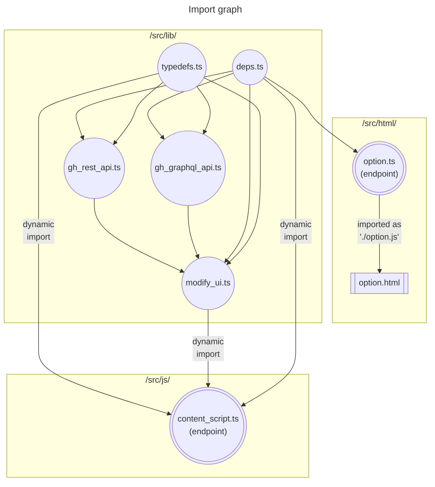

# Github Aid

This is a Chromium and Firefox extension for viewing github Repository sizes, and ~~Bulk downloading~~ selected files and subdirectories.

> TODO: The download feature has yet to be implemented

### Why?

- because two of the popular extensions which did previously work, suddenly stopped working since december 2023.
  - [github-repo-size](https://github.com/harshjv/github-repo-size)
  - [enhanced-github](https://github.com/softvar/enhanced-github)

- the codebase of both uses NodeJs, which comes along with a lot of boilerplate

- both used `manifest v2`, which will be deprecated in chromium sometime later this year

- neither looks good and usable at the same time in mobile display

-  wanted to do a fun weekend project, try out some GraphQL apis, and be done with the annoyance of constant non-functioning extensions

### How the internals differ

This project provides a good minimal-boilerplate example of how one can generate a web-extension, while:
- only using typescript, and no NodeJs boilerplate or 3rd-party typescript dependencies
- uncoupling all of the following three major parts of the code:
  - library code (responsible for fetching and parsing data from `api.github.com`), coded under [`/src/lib/`]("./src/lib/")
  - user interface code (responsible for configuring and customizing user options), coded under [`/src/html/`]("./src/html/")
  - background script (responsible for injecting this extension's UI into `github.com`), coded under [`/src/js/`]("./src/js/")
- being able to transpile, bundle, minify, and package all in one go. all thanks to the incredible [esbuild tool](https://github.com/evanw/esbuild), and its Deno compatibility plugin [esbuild_deno_loader](https://github.com/lucacasonato/esbuild_deno_loader)

If you look at a typical extension development codebase, you'll encounter:
- a lot of node-specific files
- ton of external developmental dependencies
- lots of config files for the dependencies
- lots of tasks defined by the dependencies that need to be run sequentially for the build process to work
- having to strictly adhere to a certain directory structure set by the dependencies (or their config files)
- a nighmare when trying to reference a simple typescript relative import
  - for instance, you'll need to use the `".js"` extension suffix in some occasions. other times the extension part has to be dropped
  - same directory relative import cannot be done, and has to be done relative to the project's root (where `package.json` lies)
  - having to adjust to framework specific import prefix characters

all in all, that will lead to a highly coupled codebase, and it'll be incredibly difficult to extract just one part of it for testing, or reusability somewhere else.

### The Deno build process

### General import map

### How to get a Github Access Token

- First of all, you'll need to be logged into your github account (Duh!).
- Navigate to here: [Generate new token (classic)](https://github.com/settings/tokens/new) (https://github.com/settings/tokens/new)
- Set an `Expiration` date, (you'll probably want to choose `No expiration`)
- In the `Select scopes` section, under the `repo` checkbox:
  - enable only the `public_repo` checkbox if you will NOT be viewing your private repository's stats
  - enable the whole `repo` group checkbox otherwise
- Scroll to the bottom and click on the `Generate token` button
- You will now be presented with the access token. MAKE SURE TO COPY AND SAVE IT NOW! This token will forever disapear after you close the dialog, so make sure to save it
- Paste the token into this browser extension

For a visual guide, see one of:
- https://www.geeksforgeeks.org/how-to-generate-personal-access-token-in-github/
- https://docs.github.com/en/authentication/keeping-your-account-and-data-secure/managing-your-personal-access-tokens

But remember NOT to check any scope boxes besides the `repo` one.
Doing cheking anythin else is dangerous if your key gets leaked,
and someone decides to maliciously delete your projects, or hold them for ransom.
(as if that has ever happened)
