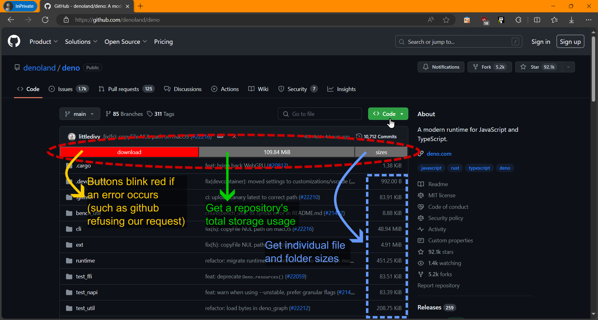

# Github Aid

This is a Chromium and Firefox extension for viewing github Repository sizes, and ~~Bulk downloading~~ selected files and subdirectories.

> [!note]
> TODO: The download feature has yet to be implemented

> [!warning]
> Currently does not work in Firefox due to its inability to dynamically import from `"web_accessible_resources"`.
> this is a long time [mozilla bug (1536094)](https://bugzilla.mozilla.org/show_bug.cgi?id=1536094), and it seems like it won't be fixed due to security concerns.

### Downloads

[](https://chromewebstore.google.com/detail/github-aid/abfbcnoemiciiljhpngefacedfgebdcn)
[](https://chromewebstore.google.com/detail/github-aid/abfbcnoemiciiljhpngefacedfgebdcn)

[](https://microsoftedge.microsoft.com/addons/detail/github-aid/gmmbjkoglimgjbdembmnllcepiejlped)
[](https://github.com/omar-azmi/github_aid_ts/releases/latest)

### Obligatory screenshots

<p float="left">
  
  
  
</p>

## Why?

- because two of the popular extensions which did previously work, suddenly stopped working since december 2023.
  - [github-repo-size](https://github.com/harshjv/github-repo-size)
  - [enhanced-github](https://github.com/softvar/enhanced-github)

- the codebase of both uses NodeJs, which comes along with a lot of boilerplate

- both used `manifest v2`, which will be deprecated in chromium sometime later this year

- neither looks good and usable at the same time in mobile display

-  wanted to do a fun weekend project, try out some GraphQL apis, and be done with the annoyance of constant non-functioning extensions


## How the internals differ

This project provides a good minimal-boilerplate example of how one can generate a web-extension, while:
- only using typescript, and no NodeJs boilerplate or 3rd-party typescript dependencies
- uncoupling all of the following three major parts of the code:
  - library code (responsible for fetching and parsing data from `api.github.com`), coded under [`/src/lib/`](./src/lib/)
  - user interface code (responsible for configuring and customizing user options), coded under [`/src/html/`](./src/html/)
  - background script (responsible for injecting this extension's UI into `github.com`), coded under [`/src/js/`](./src/js/)
- being able to transpile, bundle, minify, and package all in one go. all thanks to the incredible [esbuild tool](https://github.com/evanw/esbuild), and its Deno compatibility plugin [esbuild_deno_loader](https://github.com/lucacasonato/esbuild_deno_loader)

If you look at a typical extension development codebase, you'll encounter:
- a lot of node-specific files
- ton of external developmental dependencies
- lots of config files for the dependencies
- lots of tasks defined by the dependencies that need to be run sequentially for the build process to work
- having to strictly adhere to a certain directory structure set by the dependencies (or their config files)
- a nighmare when trying to reference a simple typescript relative import
  - for instance, you'll need to use the `".js"` extension suffix in some occasions. other times the extension part has to be dropped
  - same directory relative import cannot be done, and has to be done relative to the project's root (where `package.json` lies)
  - having to adjust to framework specific import prefix characters

all in all, that will lead to a highly coupled codebase, and it'll be incredibly difficult to extract just one part of it for testing, or reusability elsewhere.


## The Deno build process

### Building it yourself

to build this yourself, make sure that you first have [`Deno`](https://deno.com/) installed. then, in your terminal (or cmd), run:
```shell
deno task build-all
```
and you should get an unpacked distribution of the extension in the [`/dist/github_aid_ts-v*`](./dist/github_aid_ts-v0.1.0/) directory.

other available commands (tasks):
| command | general description |
|---------|---------------------|
| `deno task clean`              | delete the [`/dist/`](./dist/) folder |
| `deno task clean --js-only`    | delete only the javascript files under the [`/dist/`](./dist/) folder |
| `deno task build-1`            | copy all non-typescript source files to the [`/dist/`](./dist/) folder |
| `deno task build-2`            | bundle endpoint typescript files inside of [`/src/`](./src/),<br>and mirror the resulting javascript files to the [`/dist/`](./dist/) folder |
| add an additional `--log-only` <br> flag to any of the commands above | execute the task without actually writing or deleting any files |
| `deno task build-all-log-only` | runs `deno task build-1 --log-only`<br>and then `deno task build-2 --log-only` |


### Build diagram


### General import map


## Rationale for Code-Splitting, and its caveates

### What is Code-Splitting, and how does it differ from regular bundling?
suppose you have a total of 5 source code files (`A`, `B`, `C`, `D`, and `E`), with the following dependency graph:


if you were to bundle the endpoints `A` and `B` without code-splitting, you'd get two independently operated pieces of bundled code:


this is where a potential problem can occur: if there was a runtime-unique shared piece of code inside of `D`, then inconsistencies will arise when the two pieces of bundled codes try to interoperate. <br>
a few examples of runtime-unique shared pieces of code would be:
- a javascript `Symbol`. both `bundleA` and `bundleB` will define the symbol separately, thereby becoming incompatible
- mutative side-effects inside of `D`. if, for instance, `D.injectButton` was a function that would inject a button into your html and then set a `D.button_injected = true` flag inside so that duplicates of buttons are not made in future calls.
If both `bundleA` and `bundleB` call `D.injectButton` several times, then we'd get two buttons instead of one, because now, the flags are defined independently. <br>
had we imported from `D` instead of bundling, we would've expected to see a single injected button.

if we bundle with code-splitting enabled, we would get the following output dependency graph, and our runtime-unique shared pieces of code will interoperate correctly:


bundling with code-splitting also comes with the advantage of smaller total output file size.

### Caveates of Code-Splitting specific to browser-extensions development

first, you need to know that the extension is supposed to be a single javascript file that is executed after your designated injection-target website has loaded (this being "github.com" for this extension). <br>
the javascript file to be ran is specified in the manifest file ([`/src/manifest.json`](./src/manifest.json)), under `manifest["content_scripts"][0]["js"][0]`. <br>
the global context available to this javascript of yours is simply the same as the one available to the target webpage (i.e. you are in the `window` environment), in addition to having a limited number of browser-extension features, such as: `chrome.storage` and `chrome.runtime` (or in the case of firefox: `browser.storage` and `browser.runtime`). <br>
moreover, by web-security design, you cannot do static imports in any content_script (so `import {x, y, z} from "./abc.js"` is disallowed). <br>
however, you *can* dynamically import using `const {x, y, z} = await import("./abc.js")`, but it **will** require that the target webpage has access to that imported file, which it currently doesn't, because the file sits locally in your browser. <br>
hence, you will need to give the target website *access* to your imported javascript files, which is done by specifying the `manifest["web_accessible_resources"]` entry in the manifest file. <br>
here's how it should look: <br>
```ts
// manifest.json
{
	// ...
	"web_accessible_resources": [
		{
			"resources": [
				"*.js"
			],
			"matches": [
				"<all_urls>"
			]
		}
	],
	// ...
}
```
with that, you've solved the problem that you initiated, and made your extension less secure along the way. <br>
alternatively you can choose to bundle without code-splitting, and avoid all the fuss. but where's the fun in that? <br>
see this [stackexchange answer](https://stackoverflow.com/a/53033388), where I found this information from. <br>
also see [`/src/js/content_script.ts`](./src/js/content_script.ts#L32-L35) for the dynamic imports being done in this extension.


## License

see [`license.md`](./license.md). but for a quick summary:
- you may not execute a crawling script onto this project's contents
- you may not feed any part of the project's contents to an AI training system, or use it as an AI chat prompt
- you may not copy-paste this project and make it your own
- you may not hold me liable for any damages this code might result in

## How to get a Github Access Token

- First of all, you'll need to be logged into your github account (Duh!).
- Navigate to here: [Generate new token (classic)](https://github.com/settings/tokens/new) (https://github.com/settings/tokens/new)
- Set an `Expiration` date, (you'll probably want to choose `No expiration`)
- In the `Select scopes` section, under the `repo` checkbox:
  - enable only the `public_repo` checkbox if you will NOT be viewing your private repository's stats
  - enable the whole `repo` group checkbox otherwise
- Scroll to the bottom and click on the `Generate token` button
- You will now be presented with the access token. MAKE SURE TO COPY AND SAVE IT NOW! This token will forever disappear after you close the dialog, so make sure to save it
- Paste the token into this browser extension

For a visual guide, see one of:
- https://www.geeksforgeeks.org/how-to-generate-personal-access-token-in-github/
- https://docs.github.com/en/authentication/keeping-your-account-and-data-secure/managing-your-personal-access-tokens

But remember NOT to check any scope boxes besides the `repo` one.
Having anything else checked is dangerous if your access key gets leaked,
and someone decides to maliciously delete your projects, or hold them for ransom.
(as if that has ever happened)
